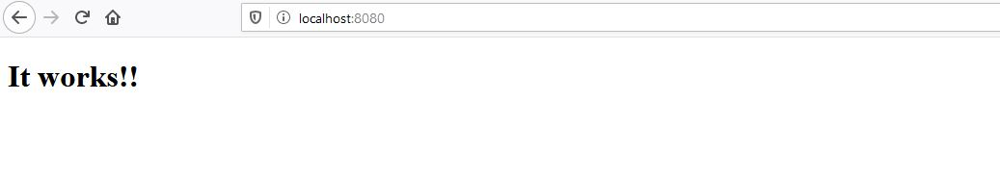
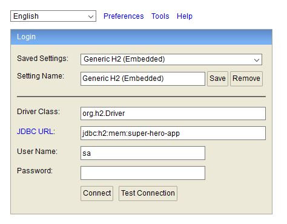
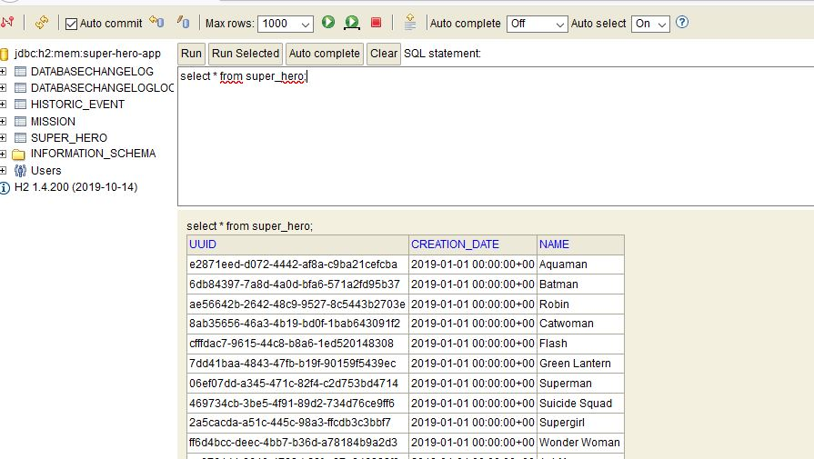
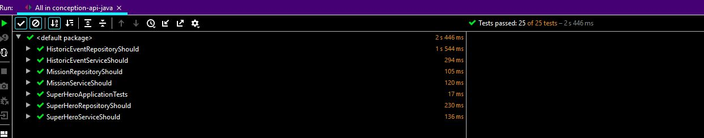

# Super hero Training Application

## Avant de commencer 
Il est essentiel de vérifier que l'existant fonctionne sur votre poste.

### Déploiement de l'application

* Depuis votre terminal, executez la commande :  

        ``mvn spring:boot-run``

- [x] Vérifiez bien que vous lancez la commande depuis la racine du projet.

Vous devriez avoir le message ci-dessous dans le terminal:


    ... superhero.SuperHeroApplication   : Started SuperHeroApplication in 8.19 seconds (JVM running for 8.888) 


* Depuis votre navigateur, allez à l'addresse: `` http://localhost:8080/``

Vous devez avoir une page comme ci-dessous: 


### Vérification des données initiales
Au démarrage, nous initialisons la table des super héros grâce à [liquibase](https://www.liquibase.org/).

Nous utilisons [H2](https://h2database.com/html/main.html) pour la persistance ( éphémère) des données en mémoire.
* Vérifiez que les données initiales ont bien été chargées:

    * Aller à l'addresse: `` http://localhost:8080/h2-console``
    
    * Connectez-vous à la base de données: 
    
- [x] Vérifiez bien que la valeur du champ JDBC URL. Elle doit être égale à:  *jdbc:h2:mem:super-hero-app*
   
    * Lister les entrées de la table super_hero:     `` select * from super_hero``
       

- [x] Tout marche bien ? Chouette ! Tous les tests sont-ils au vert ?

### Execution des tests
 
* Depuis votre terminal, executez la commande :  

        ``mvn clean test``

- [x] Vérifiez bien que vous lancez la commande depuis la racine du projet.

Vous devriez avoir le message ci-dessous dans le terminal:

    ``
    ...
    [INFO] Results:
    [INFO]
    [INFO] Tests run: 25, Failures: 0, Errors: 0, Skipped: 0
    [INFO]
    [INFO] ------------------------------------------------------------------------
    [INFO] BUILD SUCCESS
    [INFO] ------------------------------------------------------------------------
    ...
    
``
Si vous choisissez de lancer les tests depuis votre IDE ( clic droit > run all tests), vous verrez la barre verte \o/ 


## TP 1 : Définir vos APIs

Avec votre équipe métier, vous avez défini vos endpoints. Il vous faut désormais les implementer !

Pour rappel, vous avez défini les choix suivant :

Tout vos services seront exposé en V1 sur `/api/v1`

* `/super-heros` :
  * `GET` : Liste tous les super héros dans la base de données
  * `POST` : Créé un super héros
* `/super-heros/{uuid}`
  * `GET` : Récupère un super héros
  * `PUT` : Met à jour un super héros
* `/missions` :
  * `GET` : Liste toutes les missions
  * `POST` : Créé une nouvelle mission (une mission doit être rattaché à un super heros)
* `/missions/{uuid}`
  * `GET` : Récupére une mission
* `/missions/{uuid}/history-events`
  * `GET` : Liste l'historique des événements d'une mission
  * `POST` : Rajoute une nouvelle évènement dans l'historique d'une mission

## TP 4 : Tester votre API

Ha ... Théoriquement, les tests se font bien avant d'écrire le code !

Pour cette fois ci, vous êtes excusé ;-) ...

### Etape 1 : Rest Assured

Dans votre `pom.xml`, insérer une dépendance à rest-assured.

```xml
<dependency>
    <groupId>io.rest-assured</groupId>
    <artifactId>rest-assured</artifactId>
    <scope>test</scope>
</dependency>
```

Et écrivez vos tests en suivant la documentation de [Rest Assured](http://rest-assured.io/)

Voici un petit exemple de test :

```java
@DisplayName("GET /super-heroes")
@SpringBootTest(webEnvironment = SpringBootTest.WebEnvironment.RANDOM_PORT)
class GetSuperHeroesTests {

    @LocalServerPort
    private int port;
    
    private RequestSpecification given() {
        return RestAssured.given()
                .port(port)
                .basePath("/api/v1/super-heroes/");
    }

    @Test
    @DisplayName("Should return the list of super heroes")
    void shouldReturnTheListOfSuperHeroes() {
        // GIVEN
        final RequestSpecification requestSpecification = given();

        // WHEN
        final Response response = requestSpecification.get("");

        // THEN
        response.then()
                .statusCode(200)
                .header(HttpHeaders.CONTENT_TYPE, Matchers.startsWith(MediaType.APPLICATION_JSON))
                .body("name", Matchers.hasItems("Mystique", "The Punisher", "Elektra"));
    }

}
```

De temps en temps, n'hésitez pas à factoriser vos tests unitaires afin de les rendres plus lisibles !

### (Faculatif) Etape 2 : Générer une documentation à travers les tests avec Spring Rest Docs

Il est possible grâce à Rest-Assured & Spring de générer une documentation.

```xml
<dependency>
    <groupId>org.springframework.restdocs</groupId>
    <artifactId>spring-restdocs-mockmvc</artifactId>
    <scope>test</scope>
</dependency>
```

Pour plus d'information, vous pouvez utiliser la documentation de [Spring RestDocs](https://docs.spring.io/spring-restdocs/docs/current/reference/html5/)
